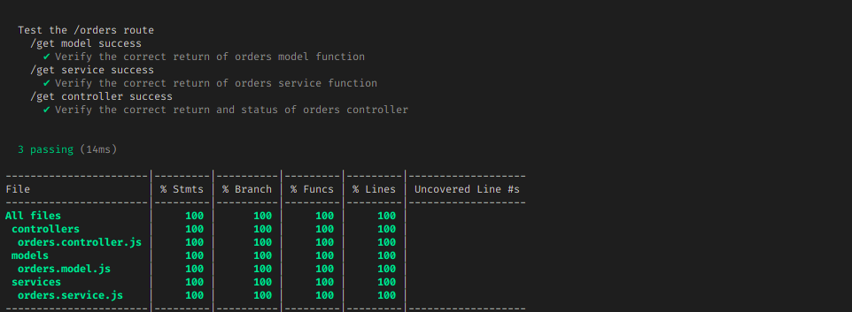

# Desafio Técnico Cashforce

  

  
  
  
    
   
  Esse projeto trata de do desafio técnico da empresa Cashforce, onde se foi colicitado a criação de uma aplicação web completa (banco de dados, backend e frontend) utilizando node, vue e sequelize de maneira que o backend forneça o endpoint para o que o frontend apresente os dados em tela.  
  
  
  ## Live
  * Localmente a aplicação está funcionando como deveria, entretanto, tendo em vista a não gratuidade do serviço de banco de dados do Heroku, a implementação do banco não foi realizada. Sendo assim, para testar a aplicação basta realizar os passos indicados na seção como rodar e testar a aplicação.

  ## Objetivos
  * Criação de um banco de dados;
  * Utilização da ORM Sequelize;
  * Criação do Backend através de uma API para prover para o Frontend;
  * Criação de uma SPA preferencialmente com o Vue.
  
  ## Decisões de projeto
  * Utilização de Javascript;
  * Opção por API com único endpoint e único verbo http;
  * Uso de ferramentas para segurança como: helmet e rate-limit
  * Utilizar o Swagger para criar a documentação e Eslint para controle de qualidade de código;
  * Utilização da arquitetura Model-Service-Controller (MSC);
  * Opção pelo Vue (mesmo sendo o meu primeiro projeto em Vue);
  * Elaborar testes cobrindo, a princípio, 100% do backend desenvolvido (avaliado com o Nyc).  
  
  ## Tecnologias utilizadas
  * node.js
  * Express Js
  * JavaScript
  * Arquitetura MSC - Model, Service, Controller
  * ORM/Sequelize
  * Commits Semânticos/ Conventional Commits
  * ESLint
  * Docker
  * Helmet
  * Rate-Limit
  * Morgan
  * Swagger
  * Nyc
  * Mocha
  * Chai
  * Sinon
  * DotEnv  

      
  ## Como Rodar
  
   Foram desenvolvidas duas maneiras de se rodar o projeto, tanto localmente quanto através de container com o Docker, entretanto, em função de limitação de Hardware, não foi possível se testar o projeto através de containers.
    
  ### Requisitos para rodar localmente
  * Node 19.3.0
  * MySQL 8.0.31
  * Npm 9.2.0
  
  ### Clonar no seu computador (via SSH)
  No terminal:
  
    git clone git@github.com:IgorMarinhoArgollo/CF-desafio.git
    
  
  Acessar a pasta do backend:
  
    cd CF-Desafio/package/backend

  Instalar dependências do backend:
  
    npm install
    
  Renomear o arquivo ".env.example" para ".env" e realizar algum ajuste com as informações do MySQL já instalado localmente.
  
  Rodar o script para criação e população do banco de dados:
  
    npm run database
    
   Iniciar o processo do backend, através do comando:
   
    npm start
    
   Em outro terminar acessar a pasta /CF-Desafio/package/frontend.
   
   Instalar as dependências do frontend com o comando:
   
    npm install
    
   Iniciar o processo do frontend com o comando:
   
    npm start
    
   Acessar ao endereço para verificar o frontend funcionando através do navegador:
   
   http://localhost:8080/

 
  

  ### Rodar apenas o backend  
  #### Iniciando a parte do backend
  acesse a pasta CF-Desafio/package/backend 
  no terminal, para startar o container:
  
    npm run dev

  Após o término da configuração a aplicação estará disponível no localhost na porta definida no .env:
  
  http://localhost:3000

  sendo a documentação disponível em:

  http://localhost:3000/docs/

  ## Rotas
  
  * GET /docs
  ------------------------
  * GET /orders
 
   
  ### Para rodar os testes do backend, basta acessar a pasta CF-Desafio/package/backend e rodar o comando:
  
    npm test
    
     
  

  ##  Autor
<a href="https://www.linkedin.com/in/igormarinhoargollo/">
 
  
 <b>Igor Marinho Argollo</b></a> 
     
 